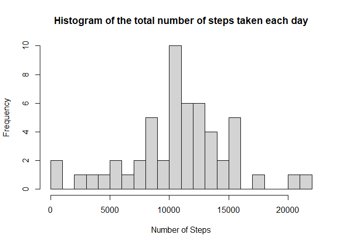
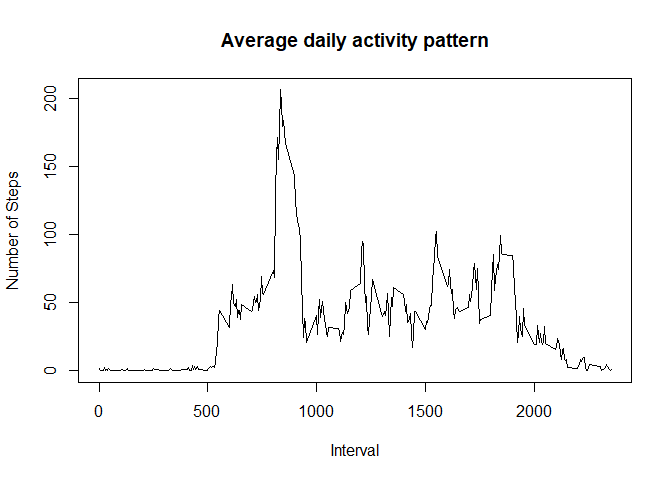
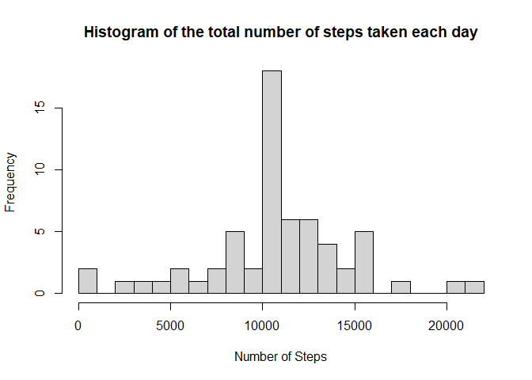
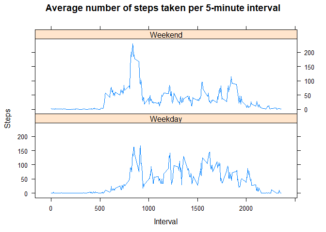

## **Loading and preprocessing the data**

1. Load the data


```r
library(lattice)
```


```r
dataset <-"./data/activity.csv"
dataURL <- "https://d396qusza40orc.cloudfront.net/repdata%2Fdata%2Factivity.zip"

# Check if the data directory exists
if (!dir.exists("./data")) {
  dir.create("./data")
}

# Check if dataset exists
if (!file.exists(dataset)) {
  # Download dataset
  download.file(url = dataURL, destfile = "./data/repdata.zip", method = "curl")
  # Unzip dataset
  unzip(zipfile = "./data/repdata.zip", exdir = "./data")
  file.remove("./data/repdata.zip")
}
```


2. Process/transform the data into a format suitable


```r
setClass('myDate')
setAs("character","myDate", function(from) as.Date(from, format="%Y-%m-%d"))

activity <-
  read.csv(
    "./data/activity.csv",
    header = T,
    sep = ",",
    na.strings = "NA",
    colClasses = c("numeric", "myDate", "numeric"),
    nrows = 17569
  )

head(activity)
```

```
##   steps       date interval
## 1    NA 2012-10-01        0
## 2    NA 2012-10-01        5
## 3    NA 2012-10-01       10
## 4    NA 2012-10-01       15
## 5    NA 2012-10-01       20
## 6    NA 2012-10-01       25
```


## **What is mean total number of steps taken per day?**


1. Calculate the total number of steps taken per day


```r
steps_per_day <- aggregate(steps~date, activity, sum)
```

2. Histogram of the total number of steps taken each day


```r
hist(
  steps_per_day$steps,
  main = "Histogram of the total number of steps taken each day",
  xlab = "Number of Steps",
  breaks = 20
)
```

<!-- -->

3. Calculate and report the mean and median of the total number of steps taken per day


```r
mean_total <- mean(steps_per_day$steps)
median_total <- median(steps_per_day$steps)
```

Mean number of steps taken each day:


```r
print(mean_total)
```

```
## [1] 10766.19
```


Median number of steps taken each day:


```r
print(median_total)
```

```
## [1] 10765
```

## **What is the average daily activity pattern?**

1. Time series plot of the average number of steps taken


```r
steps_per_interval <- aggregate(steps~interval, activity, mean)
plot(
  steps_per_interval$interval,
  steps_per_interval$steps,
  type = "l",
  main = "Average daily activity pattern",
  xlab = "Interval",
  ylab = "Number of Steps"
)
```

<!-- -->

2. The 5-minute interval that, on average, contains the maximum number of steps


```r
max_number_steps <- steps_per_interval[which.max(steps_per_interval$steps), 1]
```


5-minute interval:


```r
print(max_number_steps)
```

```
## [1] 835
```


## **Imputing missing values**

Note that there are a number of days/intervals where there are missing values (coded as `NA`). The presence of missing days may introduce bias into some calculations or summaries of the data.


1. Calculate and report the total number of missing values in the dataset (i.e. the total number of rows with `NA`s)


Missing values in *steps*:

```r
sum(is.na(activity$steps))
```

```
## [1] 2304
```

Missing values in *date*:


```r
sum(is.na(activity$date))
```

```
## [1] 0
```
Missing values in *interval*:


```r
sum(is.na(activity$interval))
```

```
## [1] 0
```

2. Devise a strategy for filling in all of the missing values in the dataset and create a new dataset that is equal to the original dataset but with the missing data filled in.


```r
a_fill <- activity
a_fill$steps <-
  ifelse(is.na(a_fill$steps) == TRUE,
         steps_per_interval$steps[steps_per_interval$interval %in% a_fill$interval],
         a_fill$steps)
head(a_fill)
```

```
##       steps       date interval
## 1 1.7169811 2012-10-01        0
## 2 0.3396226 2012-10-01        5
## 3 0.1320755 2012-10-01       10
## 4 0.1509434 2012-10-01       15
## 5 0.0754717 2012-10-01       20
## 6 2.0943396 2012-10-01       25
```


2. Histogram of the total number of steps taken each day after missing values are imputed


```r
steps_day_fill <- aggregate(steps~date, a_fill, sum)
hist(
  steps_day_fill$steps,
  main = "Histogram of the total number of steps taken each day",
  xlab = "Number of Steps",
  breaks = 20
)
```

<!-- -->

3. Make a histogram of the total number of steps taken each day and Calculate and report the mean and median total number of steps taken per day.


```r
mean_total <- mean(steps_day_fill$steps)
median_total <- median(steps_day_fill$steps)
```


```r
print(mean_total)
```

```
## [1] 10766.19
```


```r
print(median_total)
```

```
## [1] 10766.19
```

*Do these values differ from the estimates from the first part of the assignment? What is the impact of imputing missing data on the estimates of the total daily number of steps?*

The mean of the total number of steps taken per day for the missing values filled in remains the same as the original data set, the median of the total number of steps taken per day for the missing values differs from the original data set.


## Are there differences in activity patterns between weekdays and weekends?

1. Panel plot comparing the average number of steps taken per 5-minute interval across weekdays and weekends


```r
weekdays <- c("lunes",
              "martes",
              "miércoles",
              "jueves",
              "viernes")

a_fill$day <- as.factor(ifelse(
  test = weekdays(a_fill$date) %in% weekdays, 
  yes = "Weekend",
  no = "Weekday"
))

activity_total <-
  aggregate(steps ~ interval + day, a_fill, mean)

xyplot(
  steps ~interval | day,
  activity_total,
  main = "Average number of steps taken per 5-minute interval",
  xlab = "Interval",
  ylab = "Steps",
  layout = c(1, 2),
  type = "l"
)
```

<!-- -->
